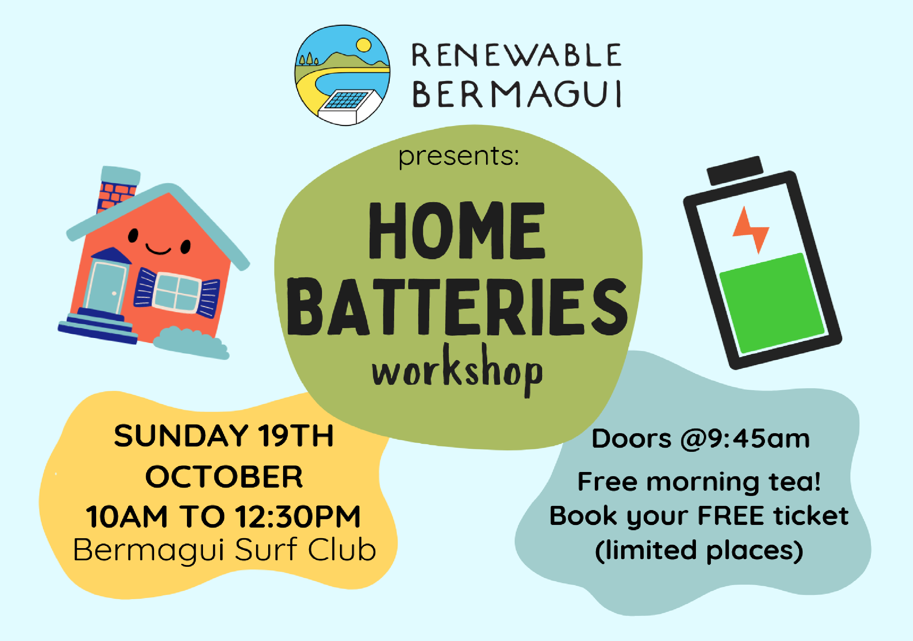
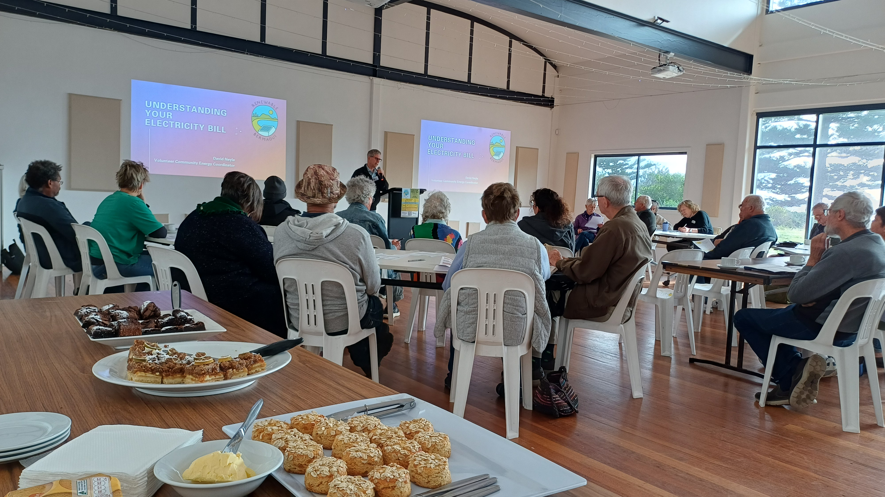

## News

### Understanding Home Batteries Workshop - October 19th
<i>Posted 30th September 2025 by Alex</i>

Our next FREE community workshop is coming up on October 19th, and it's all about <b>Home Batteries</b>: how they work, different options and incentives such as Virtual Power Plants and Amber Electric's wholesale energy pricing, and other things to think about when considering if one is right for you.

Read more about the workshop, and [book your FREE ticket on our Humanitix Event page](https://events.humanitix.com/renewable-bermagui-presents-home-batteries-workshop){:target="_blank"} to let us know you're coming!

{:target="_blank"}

### Know Your Energy Bill Workshop - recap & resources
<i>Posted 5th September 2025 by Alex</i>

Thanks to everyone for coming to our <b>Know Your Energy Bill workshop</b> on August 24th, with David Neyle. We loved everyone's engagement in the presentation and hands on session, and hope you got a lot out of it. And in a case you missed it, the workshop presentation and factsheet are available on our [Resources](/resources){:target="_blank"} page.

Keep an eye out for our next workshop on <b>October 19th - on Home Batteries</b>! Hope to see you there.

## About Renewable Bermagui

We are a community-led volunteer organisation based in Bermagui on the Far South Coast of New South Wales, formed in early 2024. We are working to bring events, education, and support our community in transitioning to renewable and sustainable technologies.

We are a local chapter of the [Cobargo and District Energy Transition group (CaDET)](https://renewablecobargo.com){:target="_blank"}.

## Contact us



Use the form above, or [CLICK HERE](https://stats.sender.net/forms/egvljd/view){:target="_blank"} to open a new tab to sign up to our newsletter.

