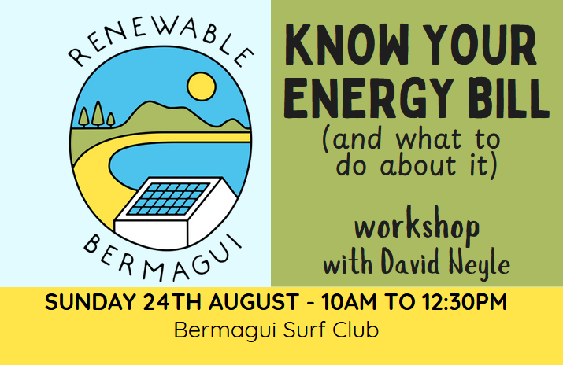

## Know Your Energy Bill workshop - August 24th

We invite you to our FREE community workshop: <b>"Know Your Energy Bill (and what to do about it)"</b> with <b>David Neyle</b> - local energy expert and former Community Energy Coordinator for Renewable Cobargo.

[Click here to book your ticket through our Humanitix event page!](https://events.humanitix.com/renewable-bermagui-know-your-energy-bill){:target="_blank"}

## About Renewable Bermagui

We are a community-led volunteer organisation based in Bermagui on the Far South Coast of New South Wales, formed in early 2024. We are working to bring events, education, and support our community in transitioning to renewable and sustainable technologies.

We are a local chapter of the [Cobargo and District Energy Transition group (CaDET)](https://renewablecobargo.com){:target="_blank"}.

## Get in touch:



Use the form above, or [CLICK HERE](https://stats.sender.net/forms/egvljd/view){:target="_blank"} to open a new tab to sign up to our newsletter.

