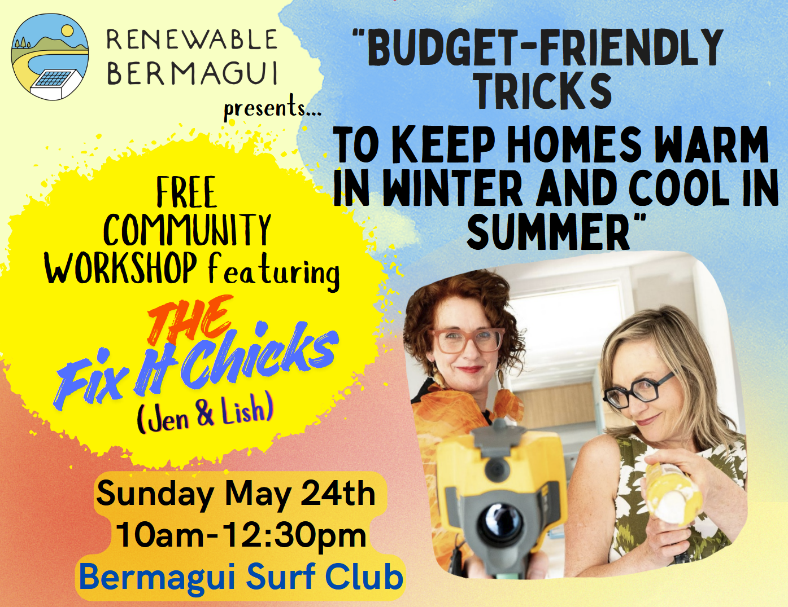
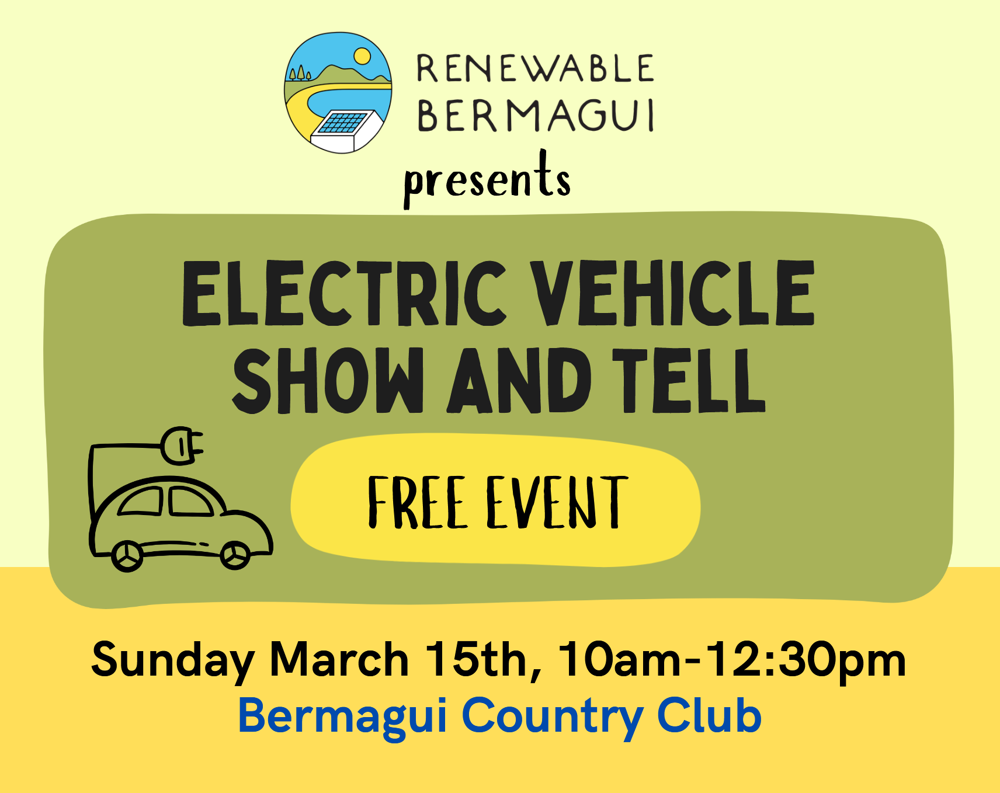
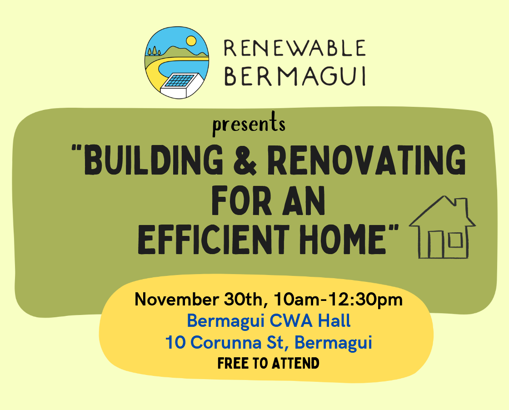
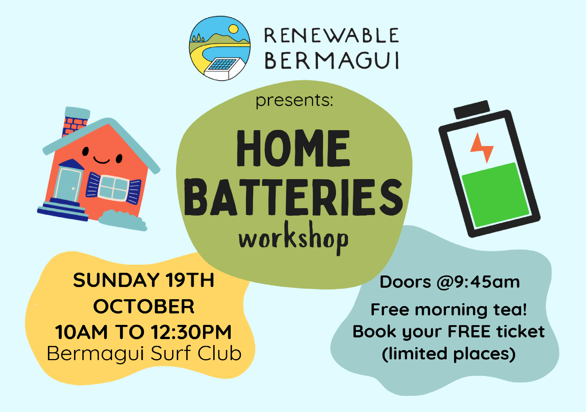
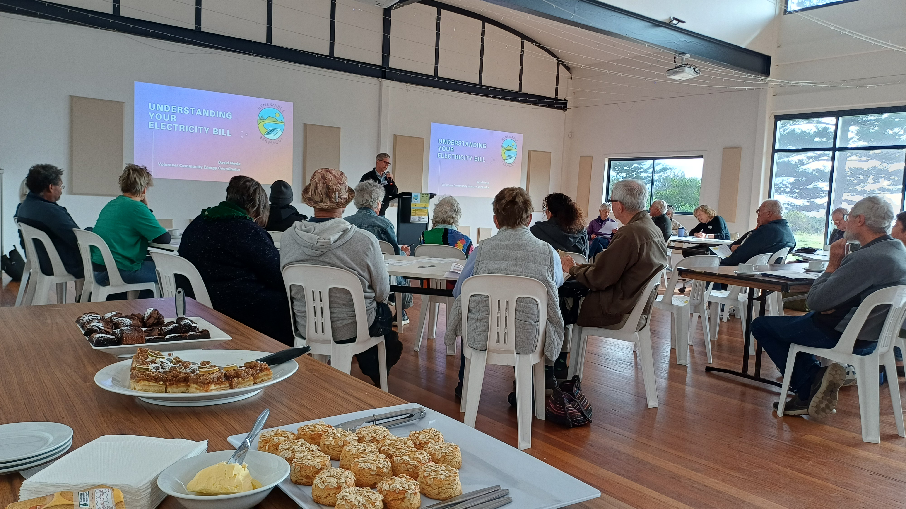

## News

### Keeping Warm & Cool with The Fix It Chicks - May 24th 2026
<i>Posted 1st May 2026 by Alex</i>

{:target="_blank"}

We're so excited to be hosting Canberra's "Fix It Chicks" (Jen and Lish) in a FREE community workshop, coming up May 24th at the Bermagui Surf Club. Come along to learn practical tips and tricks to make your home more thermally efficient, and to help you stay warmer this winter <i>and</i> cooler next summer - without breaking the budget. This workshop will be particular useful for renters, and will focus on things you can do yourself without any major purchases. The Fix It Chicks are building efficiency experts AND amazing science communicators, so this event is sure to be both informative and entertaining.

Find out more about the Fix It Chicks and [book your FREE ticket on our Humanitix Event page](https://events.humanitix.com/renewable-bermagui-presents-fixit-chicks){:target="_blank"} to let us know you’re coming! 

This event is being supported by the Bega Valley Shire Council Community Grants Program.

### Electric Vehicle Show & Tell - March 15th 2026
<i>Posted 20th February 2026 by Alex</i>

{:target="_blank"}

Our <b>Electric Vehicle Show & Tell</b> event is coming up on <b>Sunday, March 15th</b>. Come along to the <b>Bermagui Country Club</b> to view a variety of local electric vehicles (EVs) owned by locals, ask your questions and chat to them about their experience driving electric! So much has changed in the EV charging infrastructure and the variety of models available in the last couple of years... If you're considering buying an EV, or just curious - this is a great chance to check out some of the new models, and to ask your questions of local EV drivers.

The event is totally FREE for the community to attend - we'll kick off with a few talks at 10am, after which you'll all have plenty of time to chat to local electric vehicle owners!

<b>Are you an EV owner and keen to help?</b>
If you are an EV owner and would like to participate with your electric vehicle (whether you own a car, bike, outboard motor or another electric mobility device we haven't thought of yet!) there is still time to register your interest - [CLICK HERE](https://forms.zohopublic.com.au/hellorenewabl1/form/ElectricVehicleShowTellBermagui15thMarch2026/formperma/yeH2vtD_eYI72zUxv9Qm90UUD3PpNwW1J7t5TLCjwyA){:target="_blank"} to fill out a short form, or [email us](mailto:hello@renewablebermagui.org) if you have any questions.

This event is being supported by the Bega Valley Shire Council Community Grants Program.

### Building and Renovating for an Efficient Home Workshop – November 30th
<i>Posted 1st November 2025 by Cassie</i>

{:target="_blank"}

Our next FREE community workshop is coming up on November 30th on <b>Building and Renovating for an Efficient Home</b>. We’re excited to be hosting local experts [PowerHaus Engineering](https://powerhausengineering.com.au/){:target="_blank"}, who will run through upgrade options - from minor retrofits to major renovations - to help improve your home’s thermal comfort, health and energy efficiency.

Read more about the workshop, and [book your FREE ticket on our Humanitix Event page](https://events.humanitix.com/renewable-bermagui-presents-building-and-renovating-for-an-efficient-home){:target="_blank"} to let us know you’re coming! 

This event is being supported by the Bega Valley Shire Council Community Grants Program.

### Understanding Home Batteries Workshop - October 19th
<i>Posted 30th September 2025 by Alex</i>

Our next FREE community workshop is coming up on October 19th, and it's all about <b>Home Batteries</b>: how they work, different options and incentives such as Virtual Power Plants and Amber Electric's wholesale energy pricing, and other things to think about when considering if one is right for you.

Read more about the workshop, and [book your FREE ticket on our Humanitix Event page](https://events.humanitix.com/renewable-bermagui-presents-home-batteries-workshop){:target="_blank"} to let us know you're coming!

{:target="_blank"}

### Know Your Energy Bill Workshop - recap & resources
<i>Posted 5th September 2025 by Alex</i>

Thanks to everyone for coming to our <b>Know Your Energy Bill workshop</b> on August 24th, with David Neyle. We loved everyone's engagement in the presentation and hands on session, and hope you got a lot out of it. And in a case you missed it, the workshop presentation and factsheet are available on our [Resources](/resources){:target="_blank"} page.

Keep an eye out for our next workshop on <b>October 19th - on Home Batteries</b>! Hope to see you there.

## About Renewable Bermagui

We are a community-led volunteer organisation based in Bermagui on the Far South Coast of New South Wales, formed in early 2024. We are working to bring events, education, and support our community in transitioning to renewable and sustainable technologies.

We are a local chapter of the [Cobargo and District Energy Transition group (CaDET)](https://renewablecobargo.com){:target="_blank"}.

## Contact us



Use the form above, or [CLICK HERE](https://stats.sender.net/forms/egvljd/view){:target="_blank"} to open a new tab to sign up to our newsletter.

